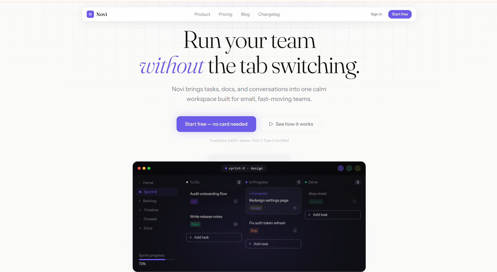

# Novi – React + TypeScript Landing Page

A modern, responsive landing page for **Novi** – a calm workspace for small, fast‑moving teams. Built with React, TypeScript, and Tailwind CSS, featuring smooth animations, a fully interactive carousel, and a modular component architecture.



## 🚀 Features

- **Hero section** with animated live board preview
- **Bento‑grid features** – boards, threads, timeline, import
- **Interactive live board** mockup (Kanban view)
- **Responsive carousel** with drag/swipe support for testimonials
- **Step‑by‑step modal** with rich visual steps
- **Reusable components** – Button, Card, Input, Modal, Carousel
- **Dark theme** with custom design tokens
- **Lucide icons** for clean, scalable vector graphics
- **Fully responsive** – mobile, tablet, and desktop optimised

## 🛠️ Tech Stack

| Technology | Purpose |
|------------|---------|
| [React 18](https://reactjs.org/) | UI library |
| [TypeScript](https://www.typescriptlang.org/) | Type safety |
| [Vite](https://vitejs.dev/) | Build tool & dev server |
| [Tailwind CSS](https://tailwindcss.com/) | Utility‑first CSS |
| [Lucide React](https://lucide.dev/) | Icon library |
| [React Hooks](https://react.dev/reference/react) | State & lifecycle |


## 📁 Project Structure
```
src/
├── components/
│   ├── common/               # Reusable UI primitives
│   │   ├── Button/
│   │   ├── Card/
│   │   ├── Input/
│   │   ├── Modal/
│   │   └── Carousel/
│   ├── layout/               # Layout components
│   │   ├── Nav/
│   │   └── Footer/
│   ├── sections/             # Page sections
│   │   ├── Hero/
│   │   ├── Features/
│   │   ├── Stats/
│   │   ├── Testimonials/
│   │   └── CTA/
│   ├── ui/                   # Complex interactive components
│   │   ├── LiveBoard/
│   │   └── StepsModal/
│   └── icons/                # Custom SVG icons
├── data/                     # Mock data & constants
│   └── mockdata.ts
├── hooks/                    # Custom React hooks
│   ├── useFadeIn.ts
│   └── useCountUp.ts
├── theme/                    # Design tokens
│   └── color.ts
├── App.tsx
├── main.tsx
└── index.css
```

## 🧩 Key Components

### `Button`
- Variants: `primary`, `secondary`, `outline`, `ghost`, `danger`
- Sizes: `sm`, `md`, `lg`
- Supports icons (left/right)
- Can render as `<a>` for links

### `Card`
- Generic container with consistent styling (border, hover glow)
- Optional `colSpan` for grid layouts
- Accepts `shadow` and `hoverShadow` props

### `Carousel`
- Infinite circular scrolling
- Responsive items per view (1 on mobile, 2 on tablet, 3 on desktop)
- Drag/swipe support
- Auto‑play with configurable interval
- Dots and arrow navigation

### `Modal`
- Generic overlay with optional title and close button
- Used by `StepsModal` for the "How it works" walkthrough

### `LiveBoard`
- Mockup of a Kanban board with live notifications
- Uses data from `mockdata.ts`

## 🚦 Getting Started

### Prerequisites
- Node.js (v16 or later)
- npm or yarn

### Installation

```bash
# Clone the repository
git clone https://github.com/12anupa-baral/Novi.git
cd Novi
```

```bash
# Install dependencies
npm install
```
Development
``` bash
npm run dev
```
The app will be available at http://localhost:5173.

Build for Production
```bash
npm run build
```
